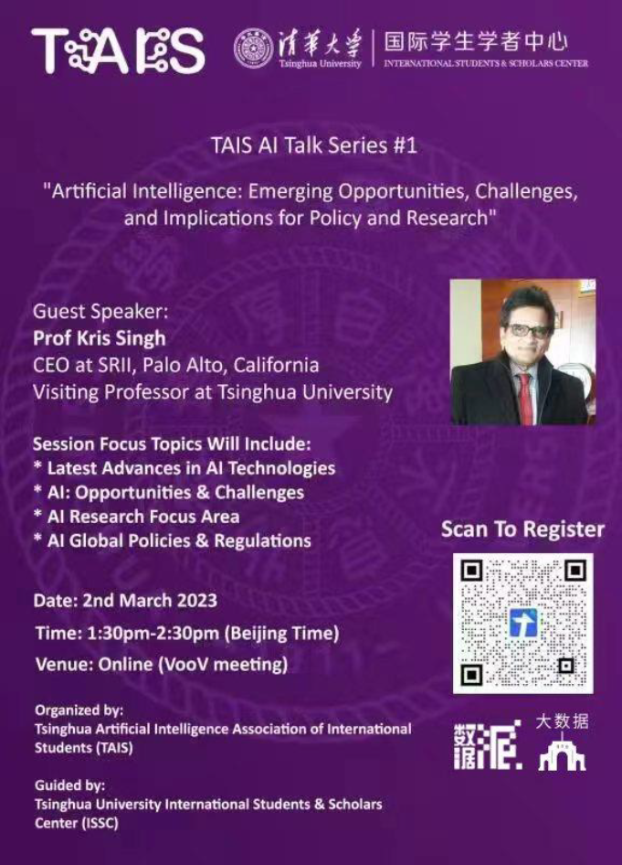

On 2nd March 2023, Tsinghua Artificial Intelligence Association of International Students (TAIS) held its first AI Talk Series "Artificial Intelligence: Emerging Opportunities, Challenges and Implications for Policy and Research" virtually, in collaboration with Tsinghua University School of Software.

The talk was delivered by Guest Speaker Professor Kris Singh (CEO of SRII and Visiting Professor of Tsinghua University) to 175 audiences.

